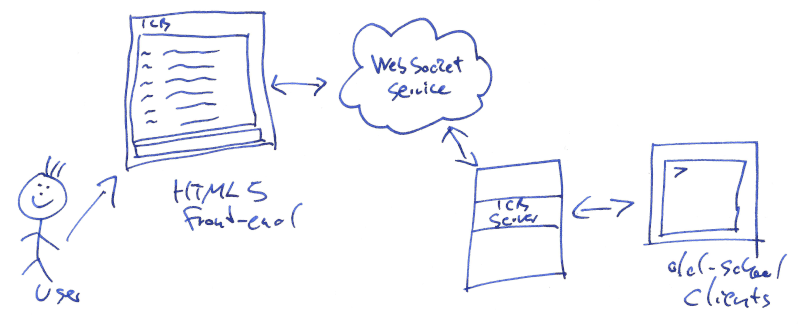

# Introduction

icb-ws is an experimental HTML5 front-end for [Internet CB Network](http://www.icb.net/).

A Python WebSocket service allows the browser to connect to a Internet CB Network server.

## Website

The front-end consists only of static web pages and scripts. Set the WebSocket url in modules/config.mjs.

## Service

The service requires [Autobahn](https://github.com/crossbario/autobahn-python/). You need at least Python 3.7 to start the service.

	$ python3.7 icb-ws.py -U ws://localhost:7329 -L 127.0.0.1 -P 7329 -s internetcitizens.band -p 7326
