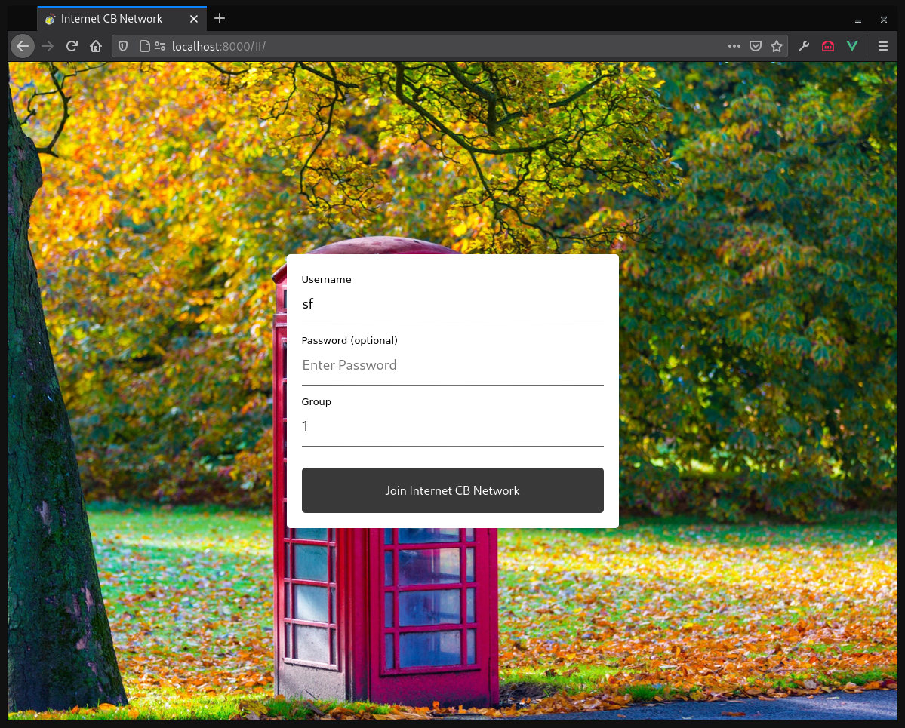
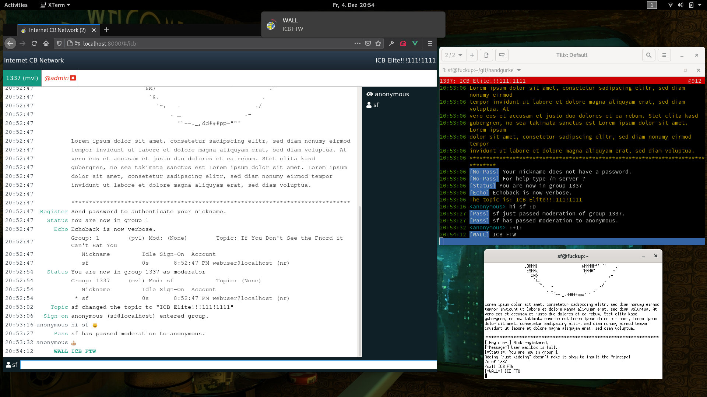

# Introduction

icb-ws is an experimental HTML5 front-end for [Internet CB Network](http://www.icb.net/).

A Python WebSocket service allows the browser to connect to a Internet CB Network server.

## Website

The front-end consists of a single web page.

Set the WebSocket url in config.mjs. Then build the website with npm:

	npm run build

## Service

The service requires [Autobahn](https://github.com/crossbario/autobahn-python/). You need at least Python 3.7 to start the service.

	$ python3.7 icb-ws.py -U wss://localhost:7329 -L 127.0.0.1 -P 7329 -s internetcitizens.band -p 7326 \
	  --ssl-key localhost.key --ssl-cert localhost.crt

## Demo

You can find a demo on [https://chat.internetcitizens.band](https://chat.internetcitizens.band).
